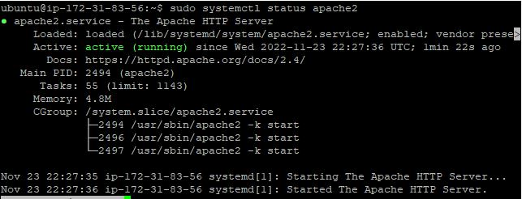
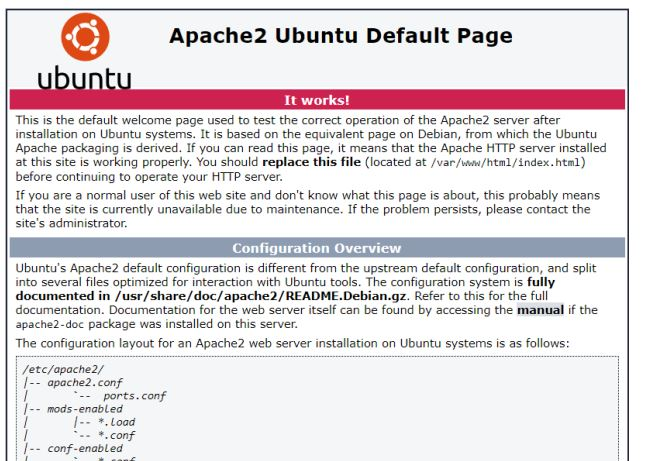
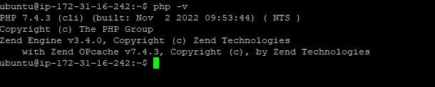
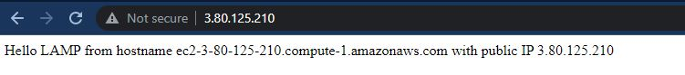
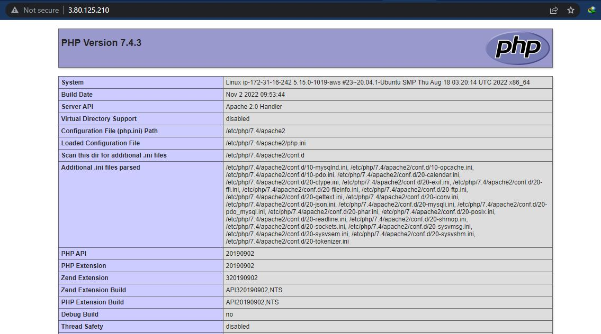

# LAMP-STACK-IMPLEMNTATION-ON-AWS
### This project shows the web stack implementation of LAMP (Linux, Apache, MySQL, PHP) on AWS

## STEP 0 - Prerequisite
In order to complete this project, you will need an AWS account and a virtual server with Ubuntu Server OS. 

## STEP 1 - HOW TO INSTALL APACHE AND UPDATE THE FIREWALL
Update a list of packages in package manager
    `sudo apt update`

Run apache2 package installation
    `sudo apt install apache2 -y`

verify that apache2 is running as a Service
    `sudo systemctl status apache2`
    

check if apache is accessible locally in Ubuntu shell
    `curl http://localhost:80 ` or `curl http://127.0.0.1:8`
    *The 2 commands above actually do pretty much the same – they use ‘curl’ command to request our Apache HTTP Server on port 80*

From the browser, check if Apache HTTP server respond to requests from the Internet.
    `http://<Public-IP-Address>:80`
    If you see following page, then your web server is now correctly installed and accessible through your firewall
    
    

## STEP 2 — INSTALLING MYSQL
Install Mysql on the ubuntu server
    `sudo apt install mysql-server -y`

Login to the MySQL
    `sudo mysql`

set a password for the root user, using mysql_native_password as default authentication method
    `ALTER USER 'root'@'localhost' IDENTIFIED WITH mysql_native_password BY 'PassWord.1';`

Exit the MySQL shell
    `exit`

Start the interactive script by running
    `sudo mysql_secure_installation`
Note: This will ask if you want to configure the VALIDATE PASSWORD PLUGIN. You would need to set a strong, unique passwords for database credentials.
For the rest of the questions, press Y and hit the ENTER key at each prompt.

Test if you’re able to log in to the MySQL console with the new password.
    `sudo mysql -p`

Exit the MySQL console with `exit`

## STEP 3 - INSTALLING PHP
Install these 3 packages
    `sudo apt install php libapache2-mod-php php-mysql`
confirm your PHP version
    `php -v`
    

## STEP 4 — CREATING A VIRTUAL HOST FOR YOUR WEBSITE USING APACHE
Create the directory for projectlamp
    `sudo mkdir /var/www/projectlamp`

Assign ownership of the directory with your urrent system user
    `sudo chown -R $USER:$USER /var/www/projectlamp`

create and open a new configuration file in Apache’s sites-available directory
    `sudo vi /etc/apache2/sites-available/projectlamp.conf`

Paste in the following bare-bones configuration
    ```
    <VirtualHost *:80>
        ServerName projectlamp
        ServerAlias www.projectlamp
        ServerAdmin webmaster@localhost
        DocumentRoot /var/www/projectlamp
        ErrorLog ${APACHE_LOG_DIR}/error.log
        CustomLog ${APACHE_LOG_DIR}/access.log combined
    </VirtualHost>
    ```
save and close the file

show the new file in the sites-available directory
    `sudo ls /etc/apache2/sites-available`

enable the new virtual host
    `sudo a2ensite projectlamp`

disable Apache’s default website
    `sudo a2dissite 000-default`

Check for syntax errors
    `sudo apache2ctl configtest`

reload Apache
    `sudo systemctl reload apache2`

Create an index.html file in that location so that we can test that the virtual host works

    ```
    sudo echo 'Hello LAMP from hostname' $(curl -s http://169.254.169.254/latest/meta-data/public-hostname) 'with public IP' $(curl -s http://169.254.169.254/latest/meta-data/public-ipv4) > /var/www/projectlamp/index.html
    ```
go to your browser and try to open your website URL using IP address
    `http://<Public-IP-Address>:80`
    

## STEP 5 — ENABLE PHP ON THE WEBSITE
edit the `/etc/apache2/mods-enabled/dir.conf` file and change the order in which the `index.php` file is listed within the DirectoryIndex directive
    `sudo vim /etc/apache2/mods-enabled/dir.conf`
    ```
    <IfModule mod_dir.c>
        #Change this:
    
        #DirectoryIndex index.html index.cgi index.pl index.php index.xhtml index.htm
    
        #To this:
    
        DirectoryIndex index.php index.html index.cgi index.pl index.xhtml index.htm
    </IfModule>
    ```
save and close the file. Reload apache
    `sudo systemctl reload apache2`
Create a new file named index.php inside the projectlamp root folder:

`vim /var/www/projectlamp/index.php`

```
<?php
phpinfo();
```
Refresh the webpage


remove the file you created as it contains sensitive information about your PHP environment -and your Ubuntu server
    `sudo rm /var/www/projectlamp/index.php`